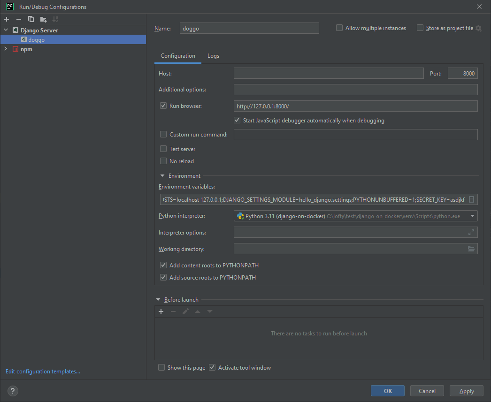
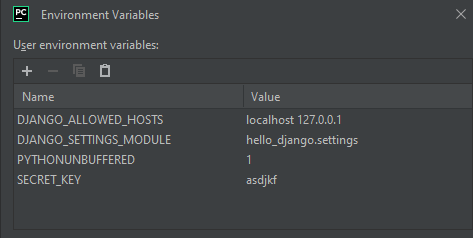

# Django Puppy farm

> What

* Scaffold https://github.com/testdrivenio/django-on-docker
* Testing
* Sqlite and postgress depending on what you wanna do. I prefer django in SPACES or outside of docker

> Additions

- [x] [Vue3](view/README.md) app added
- [x] [Vue3](view/README.md) statically served.
- [ ] Doggo Admin Import
- [ ] Doggo Admin Keys
- [ ] Doggo Special Feature

> Quickstart

* manage.py migrate
* manage.py createsuperuser --email puppy@farm.com --username woof

* Create a run config in jetbrains for easy debugging. 
* Set your env if you are on windows 
* if you build the docker you can set them as your interpreter and debug that way. 
  * (I just don't like to leave docker
    running and prefer jetbrains spaces or similar where I can remote in and use docker on "not my machine")
 
 